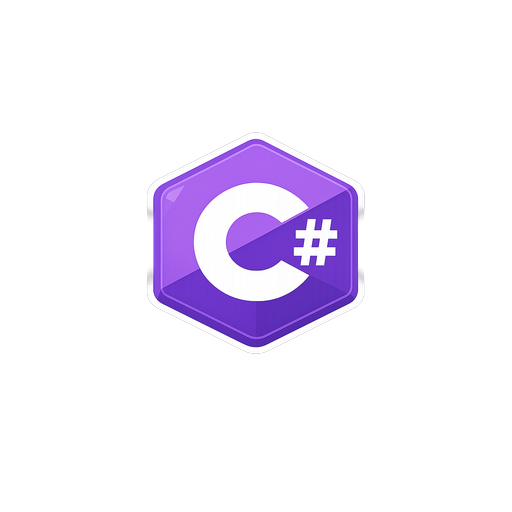

<h1 align="center">Oi, eu sou o Chris 👋</h1>

  Profissional focado em <b>Dados, Automação e Integrações</b>, desenvolvendo soluções que transformam dados operacionais em <b>informação estruturada para análise e tomada de decisão</b>.

  
  

  
  
  
  
  

---

## 👨‍💻 Sobre mim

Atuo desenvolvendo soluções voltadas para **organização, transformação e análise de dados**, principalmente em contextos de **varejo e operações comerciais**.

Trabalho criando ferramentas e automações que reduzem processos manuais, integram sistemas e estruturam dados para análise e tomada de decisão.

Minha base em desenvolvimento me permite transformar demandas operacionais em **soluções automatizadas, escaláveis e reutilizáveis**.

---

## 📊 O que eu gosto de construir

- Automação de processos operacionais
- Integração entre APIs, planilhas e bancos de dados
- Consolidação de dados para análise
- Ferramentas internas para aumento de produtividade
- Soluções de apoio à tomada de decisão

---

## 🧠 Especialidades

- 🐍 Automações e rotinas de ETL com Python
- 🗄️ Modelagem, consultas e integração com SQL Server
- 📊 Geração de relatórios e bases estruturadas em Excel
- 🔄 Integração com APIs e sistemas como Tiny ERP e marketplaces
- 📈 Simulação de margem e apoio à precificação
- ⚙️ Desenvolvimento de ferramentas internas para ganho de produtividade operacional

---

## 🧰 Stack

  
  
  
  
  
  
  
  
  
  

### Data & Automation
**Python • SQL Server • Excel**

### Development
**C# • .NET • Avalonia UI**

### Web
**HTML • CSS • JavaScript**

### Tools
**Git • GitHub**

---

## 🚀 Projetos em destaque

### 🔹 [Portfolio (Web)](https://github.com/chrisbenini/Portfolio)

Portfólio web desenvolvido para apresentar meus projetos e soluções de dados de forma visual, organizada e profissional.

**Destaques:**
- Apresentação clara dos projetos
- Organização da stack tecnológica
- Estrutura pensada para recrutadores e empresas

---

### 🔹 [Marketplace Margin Simulator](https://github.com/chrisbenini/marketplace-margin-simulator)

Ferramenta para análise estratégica de margem em marketplaces.

Permite simular rentabilidade considerando custos operacionais, taxas de plataforma e logística, auxiliando decisões de precificação.

**Destaques:**
- Consolidação automática de custos
- Simulação de margem por canal de venda
- Análise de rentabilidade por produto
- Apoio à tomada de decisão comercial

---

### 🔹 [Conversor-de-XML (Desktop)](https://github.com/chrisbenini/Conversor-de-XML)

Aplicação desktop voltada para transformar XML fiscal em uma base estruturada para análise em Excel.

**Destaques:**
- Leitura e tratamento de XML
- Estruturação de dados para uso operacional
- Geração de base pronta para análise

---

### 🔹 [tiny-extractor](https://github.com/chrisbenini/tiny-extractor)

Ferramenta de extração automatizada de dados via API para geração de base analítica.

**Destaques:**
- Coleta automatizada de dados
- Integração com fluxo analítico
- Estruturação de dados para relatórios e análises

---

## 📬 Contato

  
  &nbsp;&nbsp;&nbsp;&nbsp;
  
  &nbsp;&nbsp;&nbsp;&nbsp;
  
  &nbsp;&nbsp;&nbsp;&nbsp;
  

---

## 🌍 Short English Summary

> Data-focused developer working with automation, SQL integrations and data transformation for retail operations.  
> I build tools that transform operational data into structured and actionable insights.
